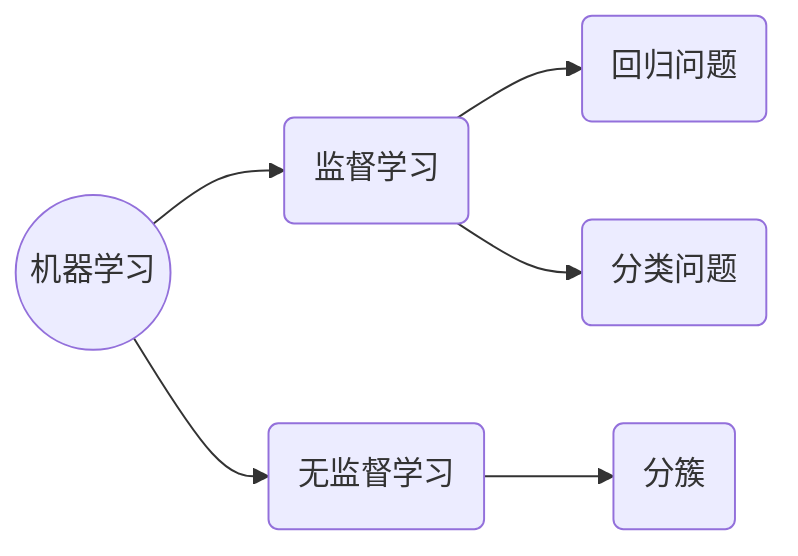

## —— 2025年1月16日更新 ——
最新的机器学习的定义：计算机程序从经验E中学习，解决某一任务T进行某一性能度量P，通过P测定在T上的表现因经验E而提高。

回归问题通常采用最小二乘法。
**最小二乘法的基本原理：**
给定一组数据点$(x1,y1),(x2,y2),…,(xn,yn)(x_1, y_1), (x_2, y_2), \ldots, (x_n, y_n)(x1​,y1​),(x2​,y2​),…,(xn​,yn​)$
目标是找到一个函数$f(x)$ 来描述这些数据点。最小二乘法的核心思想是：
- 计算预测值与真实值之间的误差：$\epsilon_i=y_i - f(x_i)$
- 定义目标函数为误差的平方和：$S = \sum_{i=1}^{n} \epsilon_i^2 = \sum_{i=1}^{n} (y_i - f(x_i))^2$
- 通过调整模型参数，使得 S 达到最小值。
对于简单的线性回归$f(x)=wx+b$，目标是求解 w 和 b 使得平方误差最小。

**数学解法**
假设模型为$f(x)=wx+b$，最小二乘法的目标是最小化：$S = \sum_{i=1}^{n} (y_i - (wx_i+b))^2$
对 $S$ 分别对 $w$ 和 $b$ 求偏导数，并令偏导数等于0，可得出一组线性方程，通过解这组方程即可得到最优参数 w 和 b。
$$ w = \frac{\sum_{i=1}^n (x_i - \bar{x})(y_i - \bar{y})}{\sum_{i=1}^n (x_i - \bar{x})^2}, \quad b = \bar{y} - w\bar{x} $$
其中$\bar{x}$和 $\bar{y}$分别是 $x$ 和 $y$ 的均值。
